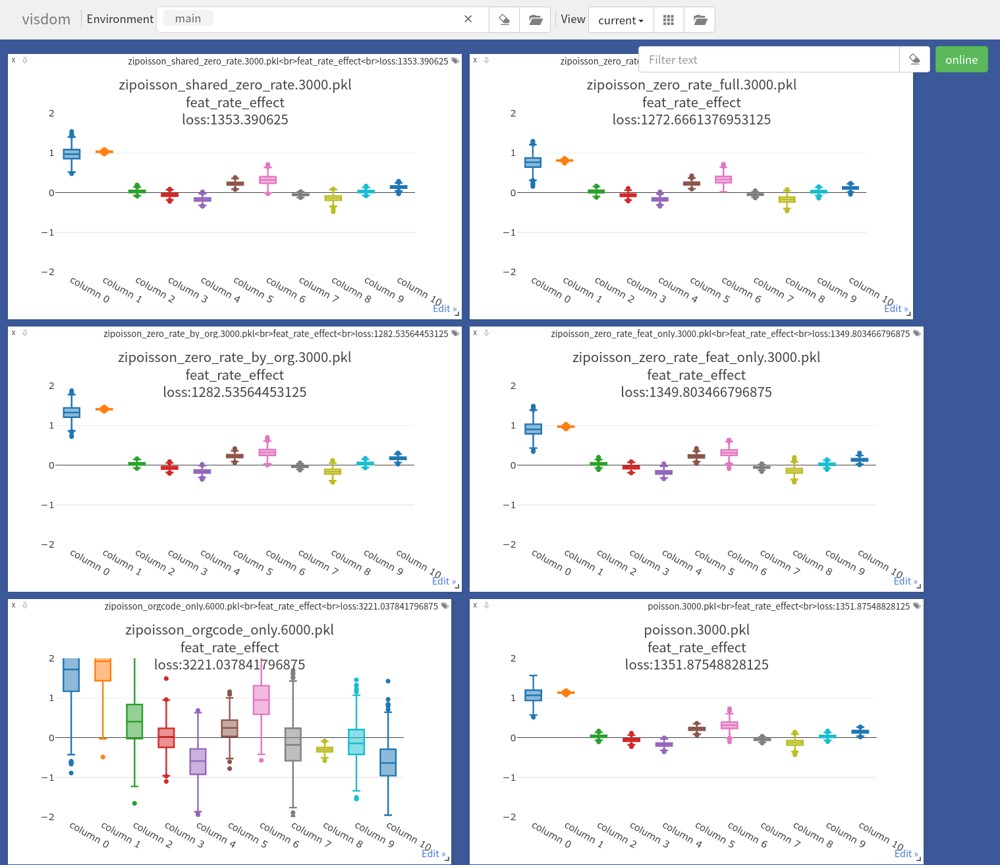

## Dep

```
tensorflow==2.11.0
tensorflow-probability==0.19.0
visdom==0.1.8.9
```

## Usage

put data at `data.csv`

```bash
python3 main_zip.py 
```


### models explained:

v3 result. It is evident that incorporating the per-org zero-rate improves the ELBO/reduce the loss.


- poisson: shared feature effects + per-orgcode intercept to predict lograte of poisson
- zipoisson_shared_zero_rate: same as poisson, but with a ZIP with a shared zerorate.
- zipoisson_zero_rate_feat_only: same as poisson, with a ZIP of zerorate with shared feature effects
- zipoisson_zero_rate_by_org: same as poisson, with a ZIP of zerorate with per-orgcode effect
- zipoisson_zero_rate_full: same as poisson, with a ZIP of zerorate with per-orgcode effect + shared feature effect
- zipoisson_orgcode_only: ZIP with lograte from only shared feature effects , and zerorate from per-orgcode effect



## Design Choices

### Parameter Parismony

To deal with the parameter parismony problem, I propose two approaches:

1. uniform prior over the whole parameter space, the cons is more parameters can always improve model. need to control complexity through other criterion like AIC/BIC
2. simple gaussian prior with a global mean/stddev. this is a more bayesian approach. cons is this choice is quite arbitrary..

This repo uses approach (1) at the moment

### Fixed or random effect

Going back to the definiction of random effect:

(1) assigning a random effect to each of the different orgcode? or
(2) should the orgcode effect be sampled from a distribtion with tied variance (also known as pooling)? I am doing (1) at the moment if it's ok
(3) in the [url](https://www.tensorflow.org/probability/examples/Linear_Mixed_Effects_Models) outlining tensorflow example, they assigned a per-group effect, and added a prior with zero-centered gaussian with tied deviation. which looks unnecessary if we are using the uniform prior


### Changelog

- v3:
  - remove parameter prior from v1. make loss value more comparable