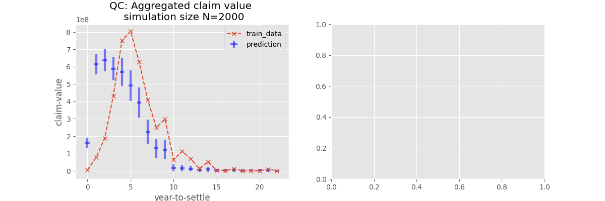
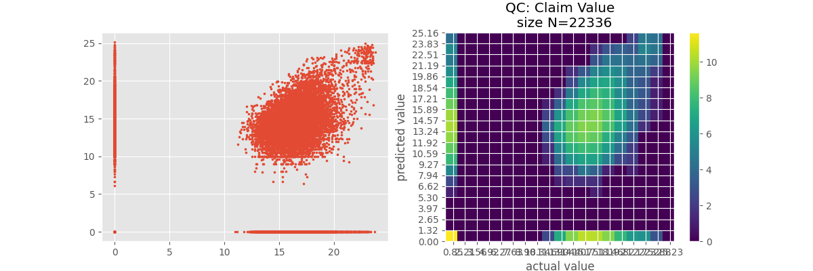
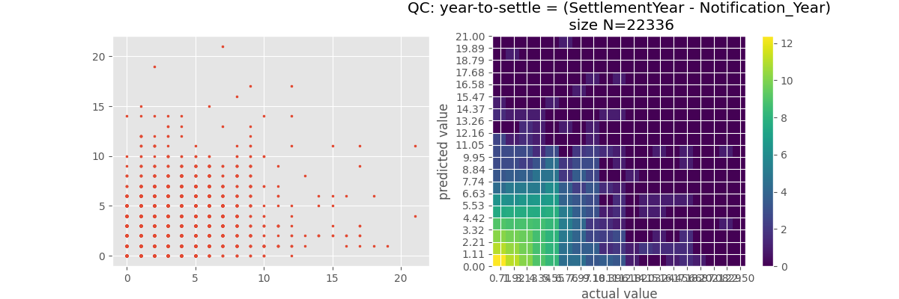

### Design Summary

maximum likelihood model with zero-infalted poisson emission on claim value
 and categorical year distribution.

### Dep

```
tensorflow==2.11.0
tensorflow-probability==0.19.0
matplotlib==3.5.3
pandas==1.1.0
docopt==0.6.2
```

Install deps, clone the repo.


### Usage

```
Usage: pred_claim.py [options]  

Options:
  -h --help                Show this screen.
  -v --version             Show the program version.
  --is_fit IS_FIT          An integer to indicate whether to fit model [default: 1].
  --data_csv DATA_CSV      CSV file to input as data [default: "./dataset.csv"].
  --input_model_file INPUT_MODEL_FILE 
                           .pkl file to input as model [default: ""].
  --output_model_prefix OUTPUT_MODEL_PREFIX 
                           prefix under which to save output model file [default: ""].
  --learning_step_list LEARNING_STEP_LIST 
                           Underscore delimited combinations of $EPOCHSx$LEARNING_RATE,
                           with "d" instead of "." 
                           for example "100x0d01_100x0d001" means 100 epochs at 0.01 learning rate, 
                           then 100 epochs at 0.001 learning rate.
                           [default: 0x1].
  --batch_size BATCH_SIZE  Batch size for making gradient step  [default: 30000].


Comment:
  Make sure DATA_CSV contain the following columns ['Region', 'Scheme', 'IsClinical', 'Incident_Year', 'Notification_Year', 'Grouped Claim', 'PortalClaim', 'Injury', 'Cause', 'Specialty', 'Location', 'Age at incident', 'IsPatientMale', 'Distance', 'Est_Settlement_Year', 'Est_Claim_Outcome', 'Est_Value', 'Settlement_Year', 'Claim_Outcome', 'Value']

Examples:
  ### initial fitting of the model
  python3 pred_claim.py --data_csv /tmp/dataset.csv --output_model_prefix ./mymodels/this-model --learning_step_list 100x0d01_100x0d001_100x0d0001 

  ### continue fitting the model
  python3 pred_claim.py --data_csv /tmp/dataset.csv --output_model_prefix ./mymodels/this-model --learning_step_list 100x0d0001  --input_model_file ./mymodels/this-model.100x0d01_100x0d001_100x0d0001.pkl

  ### plotting the first model without fitting
  python3 pred_claim.py --data_csv /tmp/dataset.csv --output_model_prefix ./test-plot --input_model_file ./mymodels/this-model.100x0d01_100x0d001_100x0d0001.pkl

  ### plotting the first on other datasets
  python3 pred_claim.py --data_csv other-dataset.csv --output_model_prefix ./test-plot --input_model_file ./mymodels/this-model.100x0d01_100x0d001_100x0d0001.pkl
```


### QC plots







